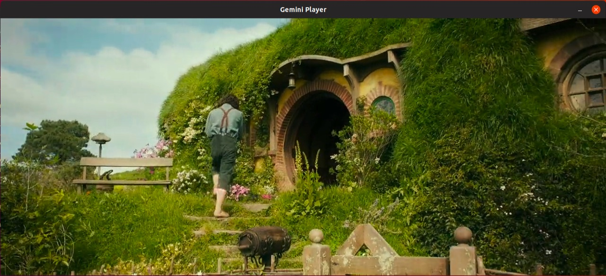

Media-Player
============

基于FFmpeg (4.0) + SDL2的视频播放器。

系统要求： Linux / MacOS

### 环境配置

#### FFmpeg
```sh
$ ./configure --enable-shared --enable-gpl --enable-version3 --enable-nonfree --enable-postproc --enable-pthreads --enable-libfdk-aac --enable-libmp3lame  --enable-libx264 --enable-libxvid --enable-libvorbis --enable-libx265
or
$ ./configure --enable-shared
$ make
# make install
```   
#### SDL2
```sh
$ ./configure
$ make
# make install
```

### UI
#### MacOS screenshot


#### Ubuntu screenshot
